# Train Ticketing System - Architecture Diagrams

## 1. Complete System Architecture


## 2. Complete Booking Journey - Simple Flow


## 2A. Complete Booking Journey - Linear Timeline

```mermaid
graph TD
    START([👤 User Starts Journey]) --> STEP1
    
    STEP1[🔐 Step 1: Login<br/>POST /api/auth/login<br/>Response: JWT Token] --> STEP2
    
    STEP2[🔍 Step 2: Search Trains<br/>GET /api/trains/search<br/>Response: Available Trains] --> STEP3
    
    STEP3[💺 Step 3: Select Seat<br/>POST /api/bookings/seats/select<br/>⚠️ CRITICAL: Redis Lock Acquired<br/>Response: Booking ID + 5 min timer] --> STEP4
    
    STEP4[📱 Step 4: Verify OTP<br/>POST /api/bookings/verify-otp<br/>Response: OTP Confirmed] --> STEP5
    
    STEP5[💳 Step 5: Make Payment<br/>POST /api/payments/initiate<br/>Response: Payment Success] --> STEP6
    
    STEP6[✅ Step 6: Confirm Booking<br/>POST /api/bookings/confirm<br/>Actions:<br/>- Update seat status<br/>- Release Redis lock<br/>- Publish to RabbitMQ<br/>Response: Ticket Generated] --> STEP7
    
    STEP7[📧 Step 7: Send Notification<br/>Async via RabbitMQ<br/>Email confirmation sent] --> END
    
    END([🎉 Booking Complete])
    
    STEP3 -.->|⏱️ Timeout 5 min| TIMEOUT[❌ Lock Released<br/>Booking Cancelled]
    TIMEOUT -.-> STEP2
    
    style START fill:#e3f2fd,stroke:#1976d2,stroke-width:2px
    style STEP3 fill:#ffebee,stroke:#c62828,stroke-width:4px
    style STEP6 fill:#e8f5e9,stroke:#2e7d32,stroke-width:3px
    style END fill:#c8e6c9,stroke:#1b5e20,stroke-width:3px
    style TIMEOUT fill:#ffcdd2,stroke:#d32f2f,stroke-width:2px
```



## 2B. Complete Booking Journey (Detailed Flowchart)


## 2C. Complete Booking Journey (State Diagram)


## 2D. Complete Booking Journey (Swimlane Diagram)


## 3. Seat Locking Mechanism (Critical Component)

```mermaid
flowchart TD
    START([User Selects Seat]) --> CHECK{Check Redis Lock}
    
    CHECK -->|Lock Exists| FAIL[Return: Seat Unavailable]
    CHECK -->|No Lock| ACQUIRE[Acquire Redis Lock]
    
    ACQUIRE --> SETKEY[Set Key: seat:{id}<br/>Value: user_id<br/>TTL: 300 seconds]
    SETKEY --> CREATEBOOK[Create Booking Record<br/>Status: PENDING]
    CREATEBOOK --> RETURN[Return: Booking ID<br/>Timer: 5 minutes]
    
    RETURN --> WAIT{User Action?}
    
    WAIT -->|Complete Payment<br/>Within 5 min| CONFIRM[Confirm Booking]
    WAIT -->|Timeout<br/>5 minutes| EXPIRE[Redis Key Expires]
    WAIT -->|User Cancels| RELEASE[Manual Release Lock]
    
    CONFIRM --> UPDATEDB[Update Seat Status: BOOKED]
    UPDATEDB --> DELLOCK[Delete Redis Lock]
    DELLOCK --> SUCCESS([Booking Complete])
    
    EXPIRE --> AUTORELEASE[Seat Auto-Released]
    RELEASE --> AUTORELEASE
    AUTORELEASE --> AVAILABLE([Seat Available Again])
    
    FAIL --> END([End])
    
    style START fill:#e3f2fd
    style CHECK fill:#fff9c4
    style ACQUIRE fill:#c8e6c9
    style CONFIRM fill:#c8e6c9
    style FAIL fill:#ffcdd2
    style EXPIRE fill:#ffecb3
    style SUCCESS fill:#a5d6a7
    style AVAILABLE fill:#a5d6a7
```

## 4. Event-Driven Architecture (RabbitMQ)


## 5. Database Schema (ER Diagram)


## 6. CI/CD Pipeline


## 7. Load Testing Architecture


## 8. Deployment Architecture (Cloud)


## 9. Monitoring Dashboard Layout


## 10. Scalability Strategy


---

## Usage Instructions

1. **For Presentation**: Copy the relevant mermaid diagrams into your slides or use tools like:
   - Mermaid Live Editor: https://mermaid.live/
   - Draw.io with Mermaid plugin
   - VS Code with Mermaid preview extension

2. **For Documentation**: Include these diagrams in your README.md or ARCHITECTURE.md

3. **For Judges**: These diagrams clearly show:
   - System architecture and component interactions
   - Data flow and business logic
   - Scalability and resilience strategies
   - Monitoring and observability approach

4. **Customization**: Adjust colors, add/remove components based on your actual implementation
