# Complete Booking Journey - Simplified Visualizations

## Option 1: Simple 6-Step Process

```mermaid
graph LR
    A[1. Login] --> B[2. Search Trains]
    B --> C[3. Select Seat<br/>🔒 Lock]
    C --> D[4. Verify OTP]
    D --> E[5. Pay]
    E --> F[6. Confirm<br/>🔓 Unlock]
    
    style C fill:#ffcdd2,stroke:#c62828,stroke-width:3px
    style F fill:#c8e6c9,stroke:#2e7d32,stroke-width:3px
```

## Option 2: Journey with Services

```mermaid
graph TD
    U[👤 User] --> |Login| AUTH[Auth Service]
    AUTH --> |JWT| U
    
    U --> |Search| TRAIN[Train Service]
    TRAIN --> |Train List| U
    
    U --> |Select Seat| BOOK[Booking Service]
    BOOK --> |Lock| REDIS[(Redis)]
    BOOK --> |Booking ID| U
    
    U --> |OTP| BOOK
    BOOK --> |Verified| U
    
    U --> |Payment| PAY[Payment Service]
    PAY --> |Success| U
    
    U --> |Confirm| BOOK
    BOOK --> |Release Lock| REDIS
    BOOK --> |Event| MQ[RabbitMQ]
    MQ --> |Notify| NOTIF[Notification]
    BOOK --> |Ticket| U
    
    style BOOK fill:#ffebee,stroke:#c62828,stroke-width:3px
    style REDIS fill:#fff9c4,stroke:#f57c00,stroke-width:2px
```

## Option 3: Horizontal Timeline

## Option 4: User Journey Map

## Option 5: Simplified Architecture Flow

## Option 6: Step-by-Step with Icons

```mermaid
graph TD
    S1[🌐 User Opens Website] --> S2[🔐 Login with Credentials]
    S2 --> S3[🔍 Search Trains<br/>Dhaka → Chittagong]
    S3 --> S4[🚂 Select Train]
    S4 --> S5[💺 Choose Seat]
    
    S5 --> LOCK{🔒 Is Seat<br/>Available?}
    LOCK -->|❌ No| S5
    LOCK -->|✅ Yes| S6[⏱️ Seat Locked<br/>5 Minutes]
    
    S6 --> S7[📱 Enter OTP]
    S7 --> S8[💳 Enter Payment]
    S8 --> S9[✅ Confirm Booking]
    S9 --> S10[🔓 Release Lock]
    S10 --> S11[🎫 Generate Ticket]
    S11 --> S12[📧 Send Email]
    S12 --> END[🎉 Done!]
    
    S6 -.->|⏰ Timeout| EXPIRE[❌ Lock Expired]
    EXPIRE -.-> S5
    
    style LOCK fill:#fff9c4,stroke:#f57c00,stroke-width:3px
    style S6 fill:#ffcdd2,stroke:#c62828,stroke-width:3px
    style S10 fill:#c8e6c9,stroke:#2e7d32,stroke-width:3px
    style END fill:#81c784,stroke:#1b5e20,stroke-width:3px
```

## Option 7: Data Flow Diagram

## Option 8: Minimal Clean Flow

---

## Which One to Use?

- **Option 1**: Simplest - just 6 boxes
- **Option 2**: Shows services involved
- **Option 3**: Timeline format (good for presentations)
- **Option 4**: User experience focused
- **Option 5**: Architecture overview
- **Option 6**: Most visual with emojis
- **Option 7**: Data flow perspective
- **Option 8**: Clean and minimal

Choose based on your audience:
- **For judges**: Option 2, 5, or 6
- **For presentation**: Option 3 or 6
- **For documentation**: Option 7 or 8
- **For quick overview**: Option 1
